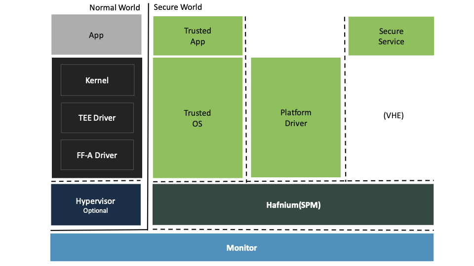

# Hafnium

Hafnium is the Secure Partition Manager(SPM) reference implementation, following the
[Arm's Firmware Framework specification](https://developer.arm.com/documentation/den0077/latest/).

It leverages Arm's virtualization extensions in the secure world of Arm's A class of
devices (feature introduced with Armv8.4 FEAT_SEL2) to allow multiple Trusted OSes or
Applications to run concurrently, inside the Trusted Execution Environment, each running
as a Secure Partition (SP).
Its main goal is to control the system access given to Trusted OSes, and serve as
a mediator to the rest of the system.

For example, it limits the memory use, and handles all system calls from Trusted OS.
Thus the SPM can enforce spacial isolation, and enforce some level of access control,
protecting other critical system resources such as: the secure monitor, the normal world
software stack, the SPM itself and other SPs/Trusted Applications.
Other important features are: secure interrupt handling, device assignment, inter-partition
communication and with the Normal World Software stack, also known as Rich Execution
Environment (REE).

The following diagram shows an overview of a typical aarch64-based system, and where Hafnium
fits:

Get in touch and keep up-to-date at:
* [hafnium@lists.trustedfirmware.org](https://lists.trustedfirmware.org/mailman3/lists/hafnium.lists.trustedfirmware.org/).
* At the community [Discord](https://discord.gg/8bxF2rRZBg).

See feature requests and bugs through [github](https://github.com/TF-Hafnium/hafnium/issues).

## Documentation

To find more about Hafnium, [view the full documentation](https://hafnium.readthedocs.io/en/latest/).
It includes valuable resources such as: Getting Started guide, Threat Model, and other documentation.
