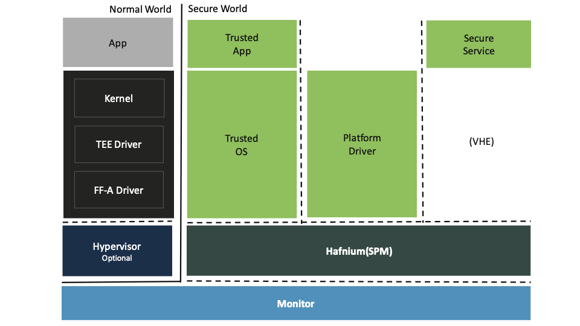

Hafnium Documentation
=====================

.. toctree::
   :maxdepth: 1
   :numbered:

   Home<self>
   about
   getting_started/index
   secure-partition-manager/index
   threat_model_spm
   change-log
   appendix
   glossary

Hafnium is the Secure Partition Manager (SPM) reference implementation, following the
`Arm's Firmware Framework specification`_.

It leverages Arm's virtualization extensions in the secure world of Arm's A class of
devices (feature introduced with Armv8.4 FEAT_SEL2) to allow multiple Trusted OSes or
Applications to run concurrently, inside the Trusted Execution Environment, each running
as a Secure Partition (SP).
Its main goal is to control the system access given to Trusted OSes, and serve as
a mediator to the rest of the system.

For example, it limits the memory use, and handles all system calls from Trusted OS.
Thus the SPM can enforce spacial isolation, and enforce some level of access control,
protecting other critical system resources such as: the secure monitor, the normal world
software stack, the SPM itself and other SPs/Trusted Applications.
Other important features are: secure interrupt handling, device assignment, inter-partition
communication and with the Normal World Software stack, also known as Rich Execution
Environment (REE).

To start using Hafnium, check the :ref:`Getting Started` guide which contains information about
how to setup the environment, build and run the tests, coding guidelines, and how to contribute.

The section :ref:`Secure Partition Manager` provides important details about the implementation.

For security information, check the :ref:`Threat Model` section, which documents identified
vulnerabilities and respective mitigations.

On our releases, the section :ref:`Change Log` will be updated to contain the summary of updates
since previous releases.

For support queries, get in touch and keep up-to-date:

- Through our mailing list `hafnium@lists.trustedfirmware.org`_.
- At the community `Discord`_.

Refer to `github`_ for feature requests and reporting bugs.

.. _Arm's Firmware Framework specification: https://developer.arm.com/documentation/den0077/latest/
.. _hafnium@lists.trustedfirmware.org: https://lists.trustedfirmware.org/mailman3/lists/hafnium.lists.trustedfirmware.org/
.. _github: https://github.com/TF-Hafnium/hafnium/issues
.. _Discord: https://discord.gg/8bxF2rRZBg

--------------

*Copyright (c) 2023, Arm Limited and Contributors. All rights reserved.*
